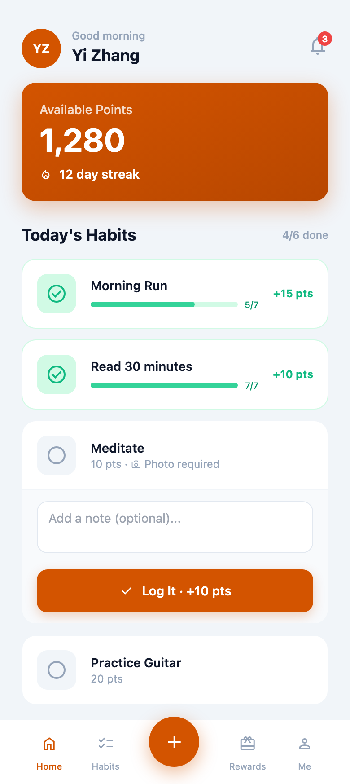
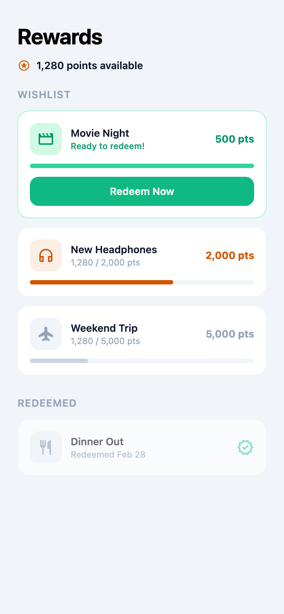
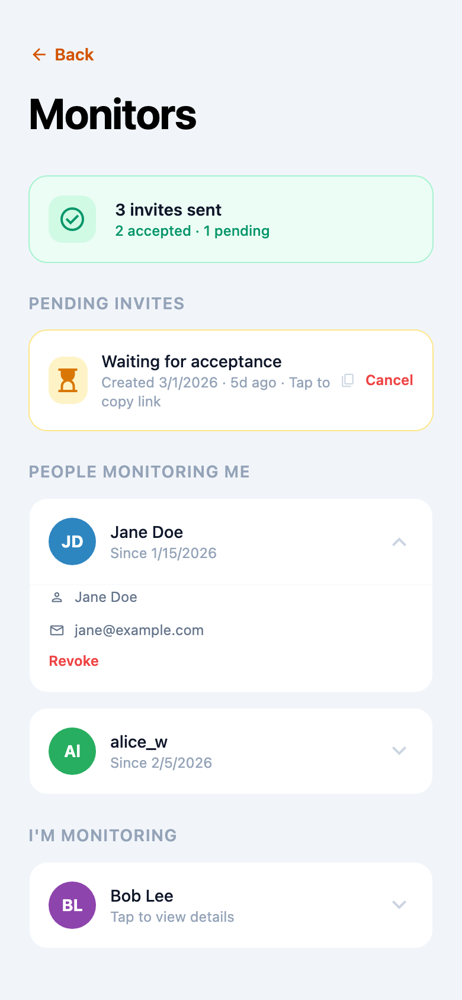
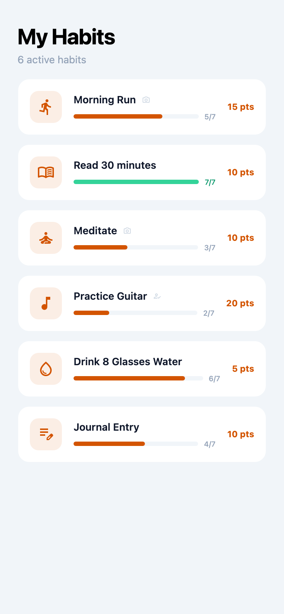
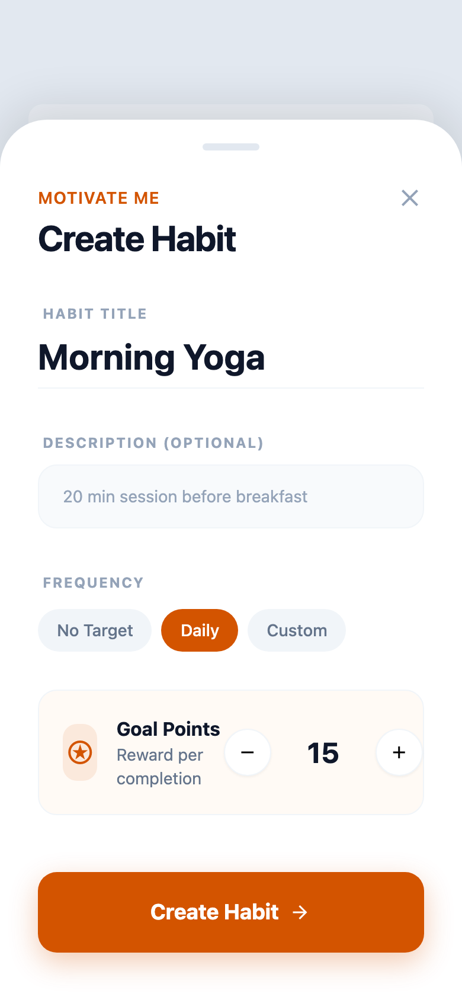
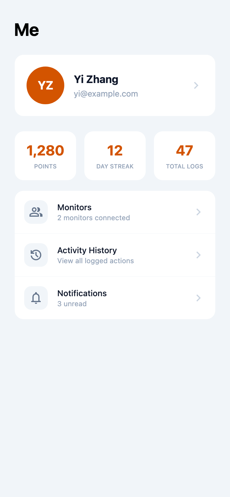

# Motivate Me

A gamified habit-tracking PWA that turns self-improvement into a rewarding game. Earn points by completing daily habits, build streaks, and redeem points for real-world rewards you choose.

**Live app:** [motivateme-cyan.vercel.app](https://motivateme-cyan.vercel.app)

---

## Screenshots

<p align="center">
  
  
  
</p>
<p align="center">
  
  
  
</p>

---

## Features

### Habit Tracking & Points
- Create custom habits with configurable point values and daily/weekly frequency targets
- Log completions inline from the dashboard with optional notes and photo proof
- Earn points for every completion — see your balance grow in real-time
- Weekly progress bars show how close you are to hitting each habit's target

### Streaks & Bonuses
- Consecutive-day streaks tracked automatically
- Milestone bonuses at 7, 30, 60, and 90 day streaks
- Streak counter displayed prominently on the dashboard

### Reward System
- Create a personal wishlist of rewards (offline activities or online purchases)
- Set point costs for each reward — from small treats to big goals
- Progress bars show how close you are to affording each reward
- Redeem when you've earned enough points

### Accountability Monitors
- Invite friends, family, or mentors as monitors via email or shareable link
- Monitors can view your habit progress and approve high-stakes actions
- Assign specific monitors to approve specific habits
- Tap to copy invite links, with visual feedback on copy
- Monitor dashboard shows the person's habits, recent logs, and point balance

### Customizable Profiles
- Generated avatars with smart initials (supports CJK, multi-word, and single-word names)
- 8 color choices for your avatar — no photo upload required
- Or upload a custom profile photo if you prefer

### Notifications
- In-app notifications for streaks, approvals, and reward milestones
- Unread badge count in the navigation

---

## Use Cases

| Who | How they use it |
|---|---|
| **Individual building habits** | Set up Morning Run, Reading, Meditation as daily habits. Earn points each day. Save up for "Movie Night" (500 pts) or "New Headphones" (2,000 pts). |
| **Couple doing a fitness challenge** | Both partners create accounts. Each invites the other as a monitor. Photo-proof habits ensure honesty. Rewards are date nights or treats. |
| **Parent motivating a student** | Parent monitors the student's account. Study habits require monitor approval before points are credited. Rewards are screen time or outings. |
| **Team accountability group** | Team members monitor each other. Weekly habits track work goals. Points and streaks create friendly competition. |

---

## Tech Stack

| Layer | Technology |
|---|---|
| Frontend | React 19 + Vite + TypeScript |
| Styling | Tailwind CSS v4 |
| Routing | React Router v7 |
| Backend | Supabase (PostgreSQL + Auth + Storage + Edge Functions) |
| Auth | Magic link (email only) — no passwords |
| Deployment | Vercel |
| Testing | Vitest + React Testing Library (152 tests) |

---

## Getting Started

### Prerequisites

- Node.js 18+
- A [Supabase](https://supabase.com) project

### Setup

```bash
# Clone the repo
git clone https://github.com/beingzy/motivate-me.git
cd motivate-me

# Install dependencies
npm install --legacy-peer-deps

# Configure environment
cp .env.example .env
# Edit .env with your Supabase project URL and anon key
```

Create a `.env` file with:

```
VITE_SUPABASE_URL=https://your-project.supabase.co
VITE_SUPABASE_ANON_KEY=your-anon-key
VITE_SITE_URL=http://localhost:5173
```

### Database Setup

Run the SQL migrations in your Supabase SQL Editor in order:

1. `supabase/migrations/001_initial_schema.sql` — core tables (habits, action_logs, point_ledger, rewards, notifications)
2. `supabase/migrations/002_monitors.sql` — monitor/accountability system
3. `supabase/migrations/003_profiles.sql` — user profiles and avatar storage

### Development

```bash
npm run dev        # Start dev server
npm test           # Run tests (152 tests across 19 files)
npm run build      # Production build
npm run lint       # ESLint
```

---

## Project Structure

```
src/
  pages/          # Route pages with co-located tests
  components/     # Shared UI components (BottomNav, AuthGate, AppShell)
  lib/            # Core logic (auth, store, db, monitors, profile, avatar)
  types/          # TypeScript interfaces
  test/           # Test utilities and wrappers
supabase/
  migrations/     # SQL migration files
  functions/      # Edge Functions (invite emails, account deletion)
docs/
  screenshots/    # App screenshots
```

## How Points Work

- Each habit has a user-defined point value
- Completing a habit awards points immediately (or after monitor approval if required)
- Streak bonuses reward consistency (7-day, 30-day, 60-day, 90-day milestones)
- Points are spent to redeem rewards — balance never goes negative
- The point ledger is append-only for full auditability

---

## License

MIT
